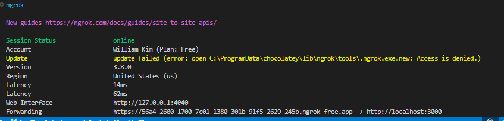
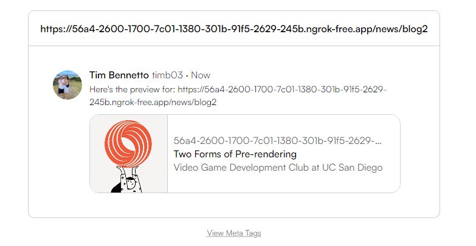

# VGDC-Website
This is the website for the Video Game Development Club at UCSD!


## Testing opengraph and twitter cards locally
A neat feature that we included is the ability to share blog posts via twitter. To do this, we utilize an internet protcol called **Opengraph**
which is basically a standardized way to provide meta data about a particular web page. We achieve this by using `<meta>` tags like so: 

`<meta property="og:site_name" content="Video Game Development Club" />`

`<meta property="twitter:image" content={'${hostname}/_next/image?url=/images/blogs/${post.id}${post.coverImage}&w=828&q=75'} />`

Each of these tags gets placed at the top of the html document. When the page link is shared to a social media platform, these meta tags are then parsed to form a rendered preview of the blog post. Here are the steps to get this working on your local dev environment: 

### 1. Install ngrok and launch it
`ngrok` is a third party tool that allows you to forward a custom (temporary) host to your localhost. The importance of this will explained in later steps. First, navigate to the official ngrok website: https://ngrok.com/ and sign up. You only get one server for the free plan which should suffice for this project. Follow the steps in your ngrok dashboard to deploy the temporary service at localhost:3000

### 2. Replace meta tags 
Because we are using a custom host and domain, we need to use the proper meta tag `content` values. Go to `\app\news\[id]\page.tsx` and replace the html meta tags with the test ones (which should be in a comment block). 

You'll probably notice these two variables as well 
```
// For testing purposes only. Replace with your custom forwarded host
const testfullpath = `https://56a4-2600-1700-7c01-1380-301b-91f5-2629-245b.ngrok-free.app/news/${post.id}`
const testhostname = 'https://56a4-2600-1700-7c01-1380-301b-91f5-2629-245b.ngrok-free.app'
```

The `testfullpath` variable is to define the full path to the blog post page you are currently looking at on your computer. This is passed to a UI component called `twitter-button` which uses this new url address to help identify this resource. The  `testhostname` is just another variable to hold the hostname which should be automatically generated for you in the ngrok cli as seen down below:
<br>
<br>




This hostname is used as a prefix to help dynamically identify the image address for meta tags that describe such content, like the one from earlier: 

```
<meta property="twitter:image" content={'${testhostname}/_next/image?url=/images/blogs/${post.id}${post.coverImage}&w=828&q=75'} />
```


### Why is the image url formatted this way?
We are essentially overwriting the `srcset` of an image component using `_next/image`. We then specify the relative path to the image in our workspace by going to the `images/blogs/blog1/image.png` as an example. We also require the use of parameters to set the aspect ratio of the image so that's why we have `&w=828&q=75` at the end.


## 3. How to preview the cards in Twitter? 
In your ngrok terminal, click on the forwarded address. It should open the same website on a new tab. Navigate to the blog post you wish to share on social media. Using the example from above, we'll copy the address:  https://56a4-2600-1700-7c01-1380-301b-91f5-2629-245b.ngrok-free.app/news/blog2

Then go to https://threadcreator.com/tools/twitter-card-validator and paste the url there. It should render a preview card like this one: 
<br>
<br>



